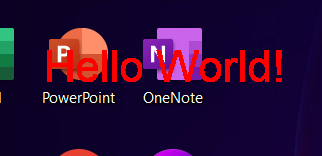

# Win32_DrawingOnEntireDesktop

  
Hello World is draw on top of the windows desktop and it stays below all other windows. This program shutsdown after 5 seconds as we don't have a typical exit-button to close the window.  
 
 
[!IMPORTANT]
The background behind the text is only drawn once at startup hence the application must be manually started without any other windows overlapping it. It remains implementing a way to refresh the background at intervals in order to avoid old background.
